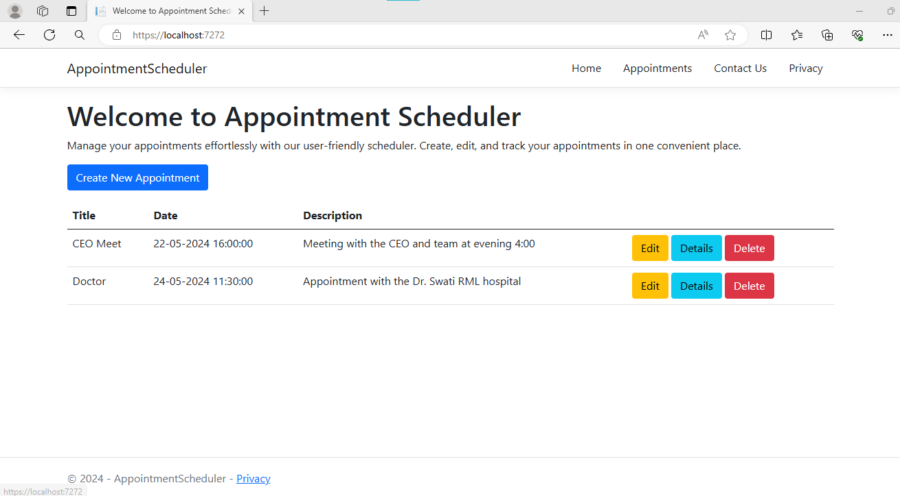
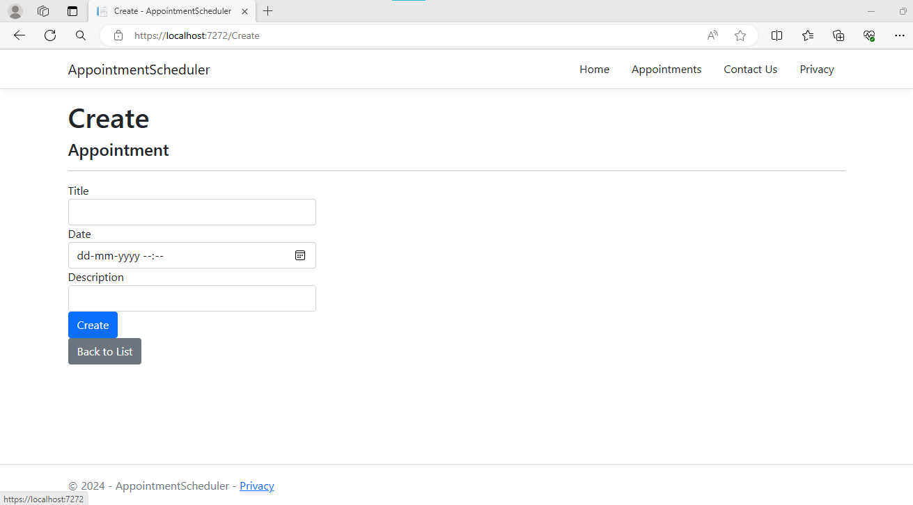
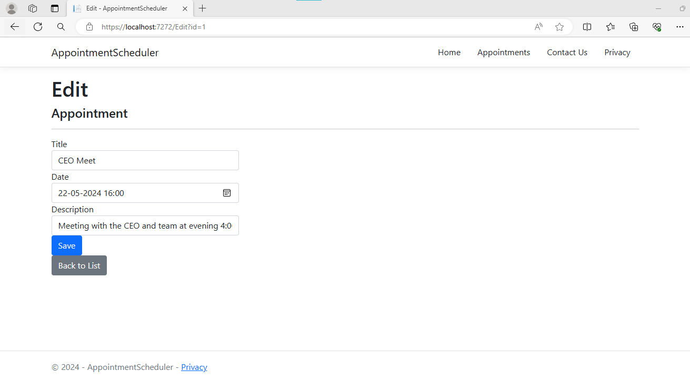
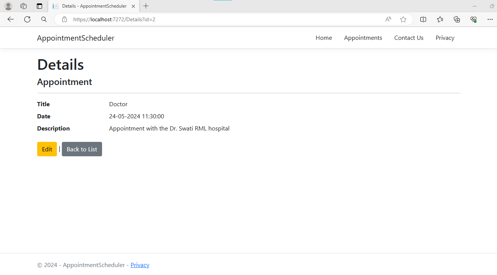
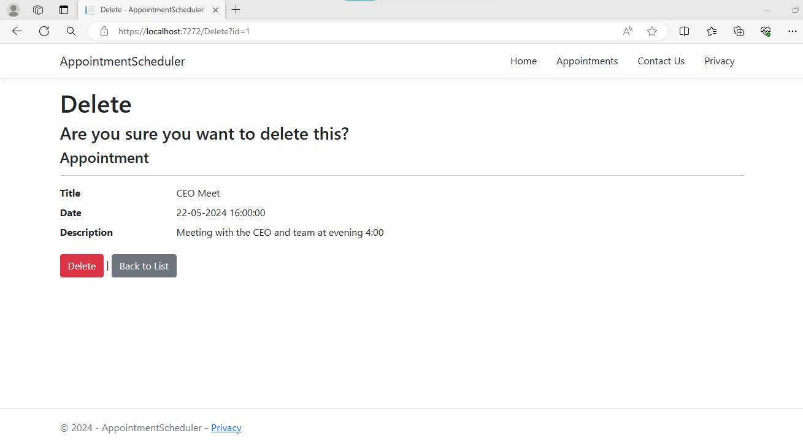
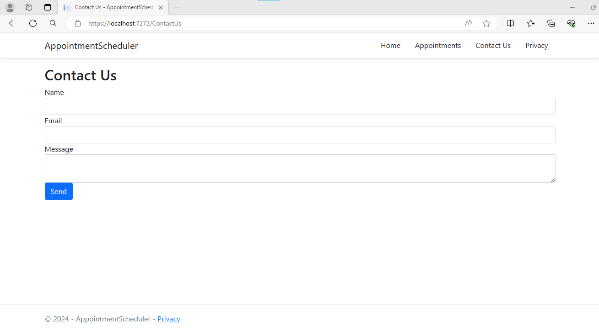
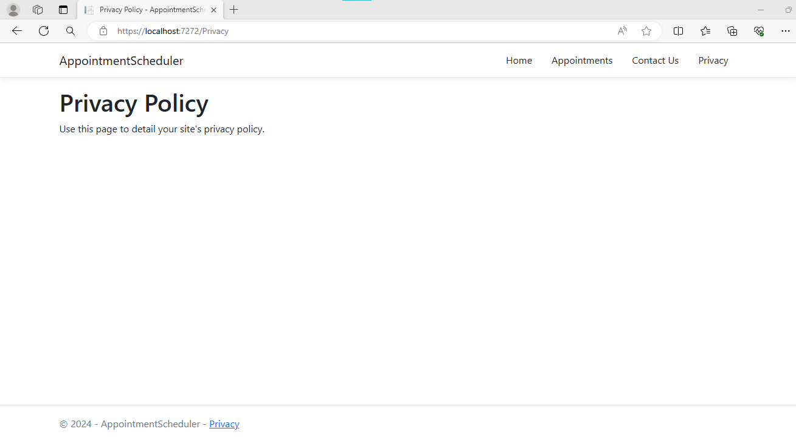

# Appointment Scheduler App

Welcome to my Appointment Scheduler project! This project was created as part of my path in learning .NET development. This is a very basic app with the purpose to allow users to efficiently schedule, view, edit, and delete appointments.
##Screenshots
### Home & Appointments Page

### Create Appointment Page

### Edit Appointment Page

### View Appointments Page

### Delete Appointment Page

### Contact Us Page

### Privacy Policy Page

## Features

- **Schedule Appointments**: Users can easily schedule appointments by specifying the date, time, and details.
- **View Appointments**: Users can view their scheduled appointments in a convenient list view with details.
- **Edit Appointments**: Users have the flexibility to edit the details of existing appointments, such as the title, date, time, or description.
- **Delete Appointments**: Users can delete appointments that are no longer needed.

## Technologies Used

- **.NET Core**: The backend of the application is built using .NET Core.
- **ASP.NET Core MVC**: ASP.NET Core MVC is used to develop the web application.
- **Entity Framework Core**: Entity Framework Core is used as the ORM (Object-Relational Mapping) framework for interacting with the database.
- **HTML/CSS/JavaScript**: The frontend of the application is developed using HTML, CSS, and JavaScript.
- **Bootstrap**: Bootstrap is utilized for responsive styling and UI components.
- **SQL Server**: SQL Server is used as the database management system to store and manage appointment data.

## Contributing

I welcome contributions from the community to improve the Appointment Scheduler App. If you find any bugs, have feature requests, or want to contribute enhancements, please submit a pull request or open an issue on GitHub.
